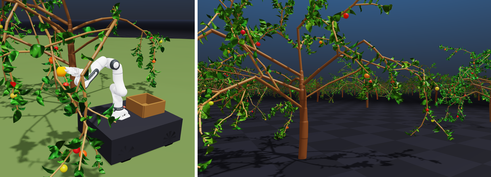

<picture>
  <source media="(prefers-color-scheme: dark)" srcset="assets/title_dark.png">
  
</picture>



**🌱 [Project page &amp; overview &rarr;](https://humphreymunn.github.io/orchardbench-page/)**

A physically-grounded, GPU-parallel **apple-orchard simulation benchmark** for
agricultural robotics, built on [NVIDIA **Newton**](https://newton-physics.github.io/newton/)
(GPU physics on [Warp](https://github.com/NVIDIA/warp) + MuJoCo-Warp).

Every run grows a *different but plausible* apple tree — a compliant, breakable
articulation of rigid branches joined by torsional spring-dampers — populates it
with detachable fruit and foliage, and (optionally) drops in a mobile
manipulator that autonomously finds, reaches, grasps and picks the fruit. Trees,
dynamics, fruit and canopy can be **domain-randomized per environment** while
staying batched on the GPU, so you can run large diverse populations for
learning and evaluation.

The branch model follows *Gentle Manipulation of Tree-Branches: A Contact-Aware
Policy Learning Approach* (Jacob, Cai, Borges, Bandyopadhyay & Ramos, **CoRL
2024**): branches as rigid cylinders + torsional "spring abstractions", stiffness
`Kp ∝ E·r⁴/l`, `Kd ∝ Kp`, decaying per branch level. See [PHYSICS.md](PHYSICS.md)
for the full modelling and equations, and the accompanying paper for the
benchmark design and baseline results.

---

## Install

The easiest path is [**pixi**](https://pixi.sh), which creates a fully pinned,
reproducible environment (Python + all dependencies) from `pyproject.toml`:

```bash
# 1. install pixi once (if you don't already have it)
curl -fsSL https://pixi.sh/install.sh | bash      # then restart your shell

# 2. from the repo root, create the environment and try it
pixi install
pixi run demo
```

`pixi run <task>` runs inside the managed environment; `pixi shell` drops you
into it. The predefined tasks are:

| task | what it does |
|------|--------------|
| `pixi run demo`    | a random deformable apple tree you can push around |
| `pixi run harvest` | autonomous harvesting (detect → reach → grasp → pull → drop) |
| `pixi run drive`   | drive a RidgebackFranka around the tree (W/S/A/D) |
| `pixi run orchard` | a batched, domain-randomized 6-tree orchard |
| `pixi run bench`   | headless benchmark / smoke test (no window) |

<details>
<summary>Prefer plain pip / conda?</summary>

Any Python 3.10–3.12 environment works. From the repo root:

```bash
python -m venv .venv && source .venv/bin/activate
pip install -e .
python scripts/grow_tree.py --viewer gl
```

This pulls `newton[examples]==1.3.0` (Warp, MuJoCo-Warp, the OpenGL viewer) plus
NumPy/SciPy/Matplotlib/Pandas/Pillow.
</details>

**Requirements.** An NVIDIA GPU with CUDA is required (Newton/Warp are
CUDA-only). Everything here was developed on an 8 GB RTX 2000 Ada laptop; smaller
scenes run comfortably, and batch size scales with VRAM. On hybrid-graphics
laptops the GL window must render on the NVIDIA GPU, or it falls back to slow CPU
copies each frame; `grow_tree.py` detects an NVIDIA GPU on Linux and sets
`__NV_PRIME_RENDER_OFFLOAD=1 __GLX_VENDOR_LIBRARY_NAME=nvidia` for you (export them
yourself to override). **The first run is slower:** Warp compiles its CUDA kernels
and the robot asset is downloaded on first launch, then both are cached, so a
second run is much faster — judge speed on the second run.

---

## Quick start

The default tree is a **random apple tree** — run it again for a different one.

```bash
# Deformable apple tree you can push around (drag with the mouse). New each run.
python scripts/grow_tree.py --viewer gl

# Apple tree with leaves and fruit (pull an apple hard -> it snaps off its stem)
python scripts/grow_tree.py --apples --foliage --viewer gl

# Branch breaking (yank a branch -> it snaps and then decelerates & settles)
python scripts/grow_tree.py --break --viewer gl

# A specific, repeatable tree
python scripts/grow_tree.py --seed 42 --apples --foliage --viewer gl

# Drive a RidgebackFranka around the tree (W/S/A/D; camera = arrows/Q/E/mouse).
# The wrist depth camera shows up as a live image panel in the viewer.
python scripts/grow_tree.py --apples --foliage --break --robot --viewer gl

# AUTONOMOUS harvesting: the robot finds apples with its depth camera, drives
# up, grasps, pulls them off and drops them in its bucket. Metrics saved.
python scripts/grow_tree.py --auto --foliage --break --viewer gl

# A whole randomized orchard, each env a different tree (physics stays batched)
python scripts/grow_tree.py --apples --num-envs 8 --randomize-envs --viewer gl

# Bumpy outdoor ground (value-noise heightfield, randomized per seed, driveable)
python scripts/grow_tree.py --auto --foliage --terrain --viewer gl

# The CoRL branch model's ternary tree class instead of an apple tree
python scripts/grow_tree.py --preset tb --depth 5 --viewer gl

# Headless smoke test / benchmark (no window)
python scripts/grow_tree.py --viewer null --frames 60

# Quick CPU preview image of the generated geometry (no GPU)
python -m treesim.viz apple 4        # writes output/skeleton.png
```

Run `python scripts/grow_tree.py --help` for the full option list.

---

## Features

- **Stochastic apple-tree generator** (default; MAppleT-style central leader +
  scaffold tiers at wide crotch angles, phyllotactic spiral, gravimorphic droop)
  — every seed grows a different but plausible tree.
- **Parametric ternary L-system** (ABoP / Honda model, classes Ta–Td) with a
  true 3-D turtle, pipe-model (da-Vinci/Murray) taper, and Gaussian domain
  randomization.
- **Compliant, breakable branches** — one rigid body + capsule per internode,
  joined by torsional spring-dampers (Euler–Bernoulli beam stiffness). Push the
  tree and it bends and springs back; branches rupture when the bending moment
  exceeds `σ_r·π·r³/4`, then go limp (hinge) or detach and fall at gravity rate.
- **Detachable apples** on the spurs — a hard sustained pull (~13–20 N) snaps
  one off; a sub-threshold tug visibly **pulls the branch with you**. The stem
  breaks under sustained *tension*, so a gripper holding the fruit by contact
  friction can pick it; a detached apple is plain ballistic.
- **Realistic foliage** — folded/curled elliptical leaf-blade meshes in 3
  instanced size classes with per-leaf colour variation: the whole canopy is a
  few draw batches and **zero physics cost** (or `--foliage-physics` for
  per-leaf fluttering bodies).
- **RidgebackFranka mobile manipulator** (`--robot`) — IsaacLab's Clearpath
  Ridgeback base + Franka FR3 arm from the real URDF, driven with **W/S/A/D**,
  with a live **wrist depth camera** panel. It collides with the tree
  (group-filtered contacts): the bumper stops at the trunk, thick limbs deflect,
  and thin twigs are pushed aside by a bounded brush force. The base rides on the
  ground via a terrain-following axis.
- **Fruit perception** — depth-only sphere-fit detection (segmentation + XYZ,
  sub-cm accuracy, ~7 ms), shown in the 3-D viewer as marker spheres at the
  estimated locations (committed pick target in orange). The same pipeline would
  run unchanged on a real RGB-D camera; the robot masks its own links from
  known kinematics.
- **Autonomous harvesting** (`--auto`) — explore (a persistent tree-centre
  belief keeps the camera oriented at the tree and lets the robot orbit-survey
  the canopy, with bump-and-retreat stuck recovery), IK-reach, close the fingers
  in a real contact grasp, pull until the stem's tension rupture gives, and drop
  the fruit in the **bucket** on the robot's back. Full cycle ~7 s of sim time.
  With `--num-envs N` every world runs its own independent picker (per-env
  perception + metrics, merged into one stand-level JSON).
- **Per-env domain randomization** (`--randomize-envs`) — geometry, material,
  fruit, growth habit (droop/lean/spread/twist) and coloration differ per env
  while the worlds stay GPU-batched. Dynamics, gains, growth habit, fruit and
  foliage randomize at **full batch speed**; only per-branch *size* variation
  (which re-dimensions every link) is more expensive. See the paper's scaling
  section and [PHYSICS.md](PHYSICS.md) for the batching breakdown.
- **Run metrics** (`--metrics`, automatic with `--auto`) — fps, grasp/pick/place
  success, cycle time, throughput, max pull force, branches snapped, detection
  precision/recall, saved as JSON.

---

## Interactive controls (OpenGL viewer)

- **Orbit / pan / zoom**: left-drag / middle-drag / scroll; **WASD/arrows + Q/E**
  fly the camera.
- **Apply force**: grab a body and drag — the viewer injects the force into the
  sim, so the branch bends (and may snap if `--break`). Grab an **apple** and
  tug: the branch bends toward you; pull harder than its stem strength and it
  snaps off.
- **Space**: pause; the side panel exposes Newton's own options.
- With `--robot`: **W/S** drive the base forward/back, **A/D** turn — the camera
  then keeps only the arrow keys / Q / E / mouse. The `wrist depth` image panel
  can be dragged anywhere.

---

## Performance notes (8 GB laptop GPU)

- **Constraint solver:** the benchmark runs MuJoCo-Warp's **CG algorithm by
  default** (`--mj-solver cg`) — several times faster than the default
  blocked-Cholesky ("newton") algorithm on this workload, and physics-identical
  on the regression matrix. CG is what makes laptop-scale batches practical
  (up to ~1024 trees on 8 GB before it runs out of memory). `--mj-solver newton`
  is kept as a fallback.
- **Fruit are the main per-step cost** — each apple is a real (3-DOF slide)
  body. `--apple-count` trades fruit for speed. Breaking and foliage are nearly
  free; on rupture the joint's actuator rows are zeroed in place (no recompile,
  no graph recapture), so the branch becomes a genuinely free hinge.
- **Rendering does not batch** the way physics does — pair large `--num-envs`
  with `--no-render` (or `--viewer null`) for headless batches.
- Mature-wood stiffness (E ≈ 8 GPa) barely bends under hand-scale forces
  (correct!); drop `physics.youngs_modulus` (e.g. `3e8`, a green sapling) for
  dramatic bending.

---

## Reproducing the paper experiments

```bash
# Run the benchmark matrix (scaling, foliage/fruit/terrain sweeps, baseline).
# Runs jobs one at a time, saving as it goes; re-run to resume.
python scripts/run_experiments.py --profile full        # or --profile quick

# Turn the results into tidy CSVs + figures + a report.
python scripts/analyze_experiments.py

# Physics scaling sweep (step rate vs number of parallel trees, CG vs newton)
python scripts/scaling_sweep.py

# On-device domain-randomization verification (device build == host build)
python scripts/test_dr_device.py
```

Outputs land under `output/`. See each script's `--help` for options.

---

## Layout

```
treesim/    config, lsystem, skeleton, physics, builder, sim, breaking,
            springs, fruit, foliage, robot, perception, picker, metrics,
            domainrand, domainrand_gpu, viz
scripts/    grow_tree.py (main entry point), run_experiments.py,
            analyze_experiments.py, scaling_sweep.py, test_dr_device.py,
            render_paper_figs.py
output/     renders, metrics JSON, experiment results (created on demand)
PHYSICS.md  modelling details and equations
```

---

## Citation

OrchardBench is described in our arXiv preprint,
[arXiv:2607.06337](https://arxiv.org/abs/2607.06337). If you use OrchardBench,
please cite:

```bibtex
@misc{munn2026orchardbench,
  title         = {OrchardBench: A Physically-Grounded, GPU-Parallel Apple-Orchard
                   Simulation Benchmark for Agricultural Robotics},
  author        = {Munn, Humphrey},
  year          = {2026},
  eprint        = {2607.06337},
  archivePrefix = {arXiv},
  primaryClass  = {cs.RO}
}
```

## License

OrchardBench is open source under the **Apache License 2.0** — free to use, modify
and distribute (including commercially), with an explicit patent grant. See
[LICENSE](LICENSE).
